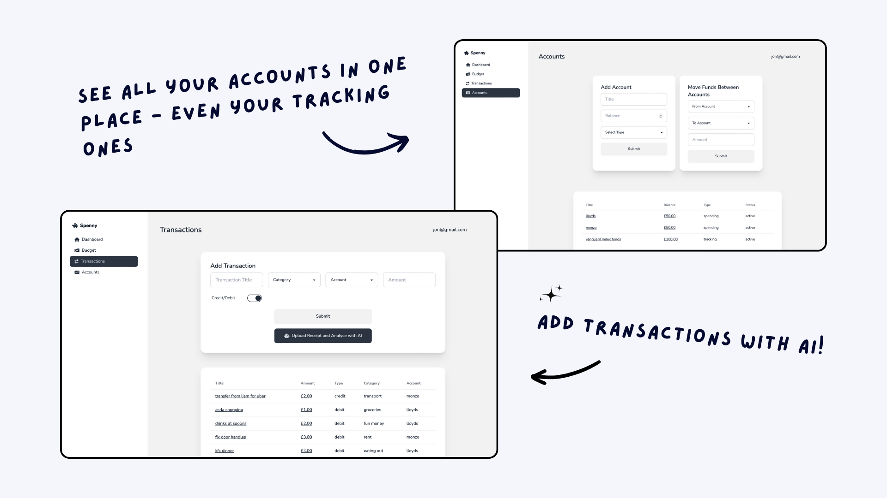

# 📊 Spenny

Welcome to **Spenny**, a zero-based budget tool for desktop & mobile, inspired by the popular YNAB software, and built using the MERN stack!

## 🌟 Features

### Users

- 📝 **Sign Up & Login**: Create an account with a username and password.
- 🛠️ **Automatic Setup**:
  - Generic categories and a spending account with zero balance.
  - Random profile picture generated using an online service.

### Accounts

- ➕ **Add & Update Accounts**: Create new accounts and update balances.
- 📂 **Archive Accounts**: Archive instead of deleting to maintain data integrity.
- 💳 **Types of Accounts**:
  - **Spending** (e.g., Barclays, Lloyds)
  - **Tracking** (e.g., Vanguard Index Fund Portfolio)
- 🔄 **Money Transfers**: Move money between accounts (spending <-> tracking).

### Categories

- ➕ **Manage Categories**: Add, delete, and update assigned values.
- 🎯 **Category Goals**: Set goals for each category.
  - **Spending Goal**: Assign a target amount by a specific day each week.
  - **Saving Goal**: Achieve a target amount without a set deadline.

### Transactions

- 💸 **Manage Transactions**: Add, delete, and update transactions.
- ➕ **Debit/Credit**: Adjust account and category balances accordingly.
- 🔄 **Effect on Budget**: Automatically updates funds and category assignments.

### Analytics

1. **Total Spend for the Week**: Track weekly spending and trends.
2. **Spending by Category**: View spending distribution across categories.
3. **Net Worth Tracking**: Monitor net worth over time.
4. **Income vs. Expenses**: Compare weekly income and expenses.
5. **Savings Rate**: Calculate the percentage of income saved each week.

## 🔗 Endpoints

| Endpoint                        | Method | Description                     |
| ------------------------------- | ------ | ------------------------------- |
| `/accounts`                     | GET    | Retrieve all user accounts.     |
| `/accounts`                     | POST   | Add a new account.              |
| `/accounts/:id`                 | PATCH  | Update account by ID.           |
| `/accounts/moveMoney`           | POST   | Move money between accounts.    |
| `/accounts/archive/:id`         | POST   | Archive an account by ID.       |
| `/analytics/totalSpend`         | GET    | Get total spend for the week.   |
| `/analytics/spendByCategory`    | GET    | Get spending by category.       |
| `/analytics/networth`           | GET    | Get net worth.                  |
| `/analytics/incomeVsExpenses`   | GET    | Get income vs. expenses.        |
| `/analytics/savingsRate`        | GET    | Get savings rate.               |
| `/analytics/alltime`            | GET    | Get all-time analytics.         |
| `/budget/readyToAssign`         | GET    | Get amount ready to assign.     |
| `/budget/assignToCategory`      | POST   | Assign money to a category.     |
| `/budget/moveBetweenCategories` | POST   | Move money between categories.  |
| `/budget/removeFromCategories`  | POST   | Remove money from categories.   |
| `/categories`                   | GET    | Get all user categories.        |
| `/categories`                   | POST   | Add a new category.             |
| `/categories/:id`               | PATCH  | Update category by ID.          |
| `/categories/:id`               | DELETE | Delete category by ID.          |
| `/goals`                        | GET    | Get all user goals.             |
| `/goals`                        | POST   | Add a new goal.                 |
| `/goals/:id`                    | PATCH  | Update goal by ID.              |
| `/goals/:id`                    | DELETE | Delete goal by ID.              |
| `/transactions`                 | GET    | Get all user transactions.      |
| `/transactions`                 | POST   | Add a new transaction.          |
| `/transactions/ai`              | POST   | Add transaction using AI.       |
| `/transactions/:id`             | PATCH  | Update transaction by ID.       |
| `/transactions/:id`             | DELETE | Delete transaction by ID.       |
| `/users/login`                  | POST   | User login.                     |
| `/users/signup`                 | POST   | User signup and initialization. |

## 📋 Status Codes

- **200 OK**: Request succeeded.
- **201 Created**: New resource created.
- **204 No Content**: Request processed successfully without content.
- **400 Bad Request**: Client error in request.
- **401 Unauthorized**: Authentication required.
- **404 Not Found**: Resource not found.
- **500 Internal Server Error**: Server error.

---

✨ Enjoy budgeting with Spenny! Manage your finances with ease and achieve your goals. Happy budgeting! 💰
